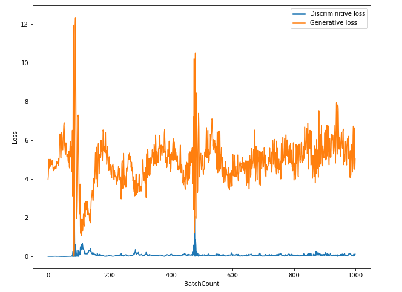
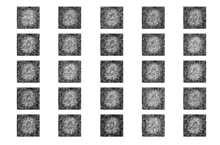

# Vanilla_GAN
Tensorflow implementation of GAN

## Requirements
* tensorflow 2.x
* python 3.x

## Core code
```python
def build_generator(img_shape, z_dim):
  model = Sequential()

  model.add(Dense(n_hidden, input_dim = z_dim)) # 인풋은 100 다음은 128개의 노드
  model.add(LeakyReLU(alpha = 0.01))
  model.add(Dense(28 * 28 * 1, activation="tanh")) # 128개의 노드 다음은 784개의 노드

  model.add(Reshape(img_shape))
  return model
  
def build_discriminator(img_shape):
  model = Sequential()

  model.add(Flatten(input_shape = img_shape)) # 이미지 모양대로 입력받아서 폄
  model.add(Dense(n_hidden))
  model.add(LeakyReLU(alpha=0.01))
  model.add(Dense(1, activation="sigmoid"))

  return model
```

## Model


## Training details (epoch < 500)

### loss


## Training details (epoch < 1000)

### loss


## Results
### epoch=500


### epoch=1000


## Author
👤 **SangBoem-Hahn**

- Github: [@SangBoem-Hahn](https://github.com/SangBeom-Hahn)
- Blog : [Tistory(GAN)](https://hsb422.tistory.com/entry/%EB%AF%B8%EB%85%BC%EB%AC%B8-%EA%B5%AC%ED%98%84-PARTGAN)
